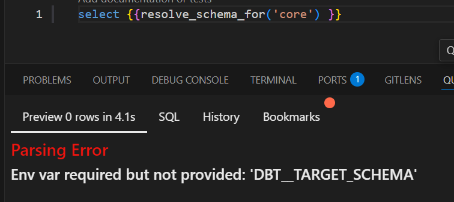

# Homework result
## Review Counts
[Review Counts](/dbt/nyc_tripdata/analyses/00-review-count-ext_tripdata.sql)

| table |	count |
| --- | --- |
| ext_green_tripdata	| 7778101 | 
| ext_yellow_tripdata	| 109047518 | 
| ext_fhv_tripdata	| 54220903| 

## Question 1: Understanding dbt model resolution
Provided you've got the following sources.yaml
```yaml
version: 2

sources:
  - name: raw_nyc_tripdata
    database: "{{ env_var('DBT_BIGQUERY_PROJECT', 'dtc_zoomcamp_2025') }}"
    schema:   "{{ env_var('DBT_BIGQUERY_SOURCE_DATASET', 'raw_nyc_tripdata') }}"
    tables:
      - name: ext_green_taxi
      - name: ext_yellow_taxi
```

with the following env variables setup where `dbt` runs:
```shell
export DBT_BIGQUERY_PROJECT=myproject
export DBT_BIGQUERY_DATASET=my_nyc_tripdata
```

What does this .sql model compile to?
```sql
select * 
from {{ source('raw_nyc_tripdata', 'ext_green_taxi' ) }}
```

- `select * from dtc_zoomcamp_2025.raw_nyc_tripdata.ext_green_taxi`
- `select * from dtc_zoomcamp_2025.my_nyc_tripdata.ext_green_taxi`
- `select * from myproject.raw_nyc_tripdata.ext_green_taxi`

**`select * from myproject.my_nyc_tripdata.ext_green_taxi`**

- `select * from dtc_zoomcamp_2025.raw_nyc_tripdata.green_taxi`


## [Question 2: dbt Variables & Dynamic Models](https://github.com/DataTalksClub/data-engineering-zoomcamp/blob/main/cohorts/2025/04-analytics-engineering/homework.md#question-2-dbt-variables--dynamic-models)
Test set
- command line args 60
- env vars 45
- default 30

`where pickup_datetime >= '{{ var("days_back", env_var("DAYS_BACK", "30")) }}' DAY`
1. Overriding fact materialization as view for debugging
1. First Test (No var, no env var)
    1. `dbt compile` 
    1. check target folder: 
    ```
    where pickup_datetime >=
    cast(cast(
        cast(now() as timestamp)
        at time zone 'UTC' at time zone 'Etc/UCT'
        as timestamp
    ) as date) + ((interval '1 day') * (-30))
    ```
1. Second Test (No var, env var set)
    1. `export DAYS_BACK=45`
    1. `dbt compile` 
    1. check target folder: `) as date) + ((interval '1 day') * (-45))`
1. Third Test ( var set , env var set)    
    1. `dbt compile --vars '{"days_back":"62"}'` 
    1. check target folder: `) as date) + ((interval '1 day') * (-62))`

**Answer** D or 4th
**Update the WHERE clause to pickup_datetime >= CURRENT_DATE - INTERVAL '{{ var("days_back", env_var("DAYS_BACK", "30")) }}' DAY**


## Question 3: dbt Data Lineage and Execution - D or 4th

**dbt run --select +models/core/**
Under the assumption that `fct_taxi_monthly_zone_revenue` is outside the models/core folder

## Question 4: dbt Macros and Jinja
 
Setting up a model like this
```
{{ config(
    materialized='view',
    schema='custom_schema'
) }}
```

Results in   
`create view "dtc_zoomcamp_2025_nyc_tripdata"."public_custom_schema"."fact_recent_taxi_trips"`
I don't understand why it concatenates 
public from: [profiles.yml](./dbt/profiles.yml) 
`schema: "{{ env_var('DBT_OUTPUT_SCHEMA') }}"` + `schema='custom_schema'`

Trying to answer the question:
* Requiribility of env vars

If i just execute analysis using macro [resolve_schema_for](./dbt/nyc_tripdata/macros/resolve_schema_for.sql)



So

**Answers**
That all being said, regarding macro above, **select all statements that are true to the models using it**:
- **- Setting a value for  `DBT_BIGQUERY_TARGET_DATASET` env var is mandatory, or it'll fail to compile**
- Setting a value for `DBT_BIGQUERY_STAGING_DATASET` env var is mandatory, or it'll fail to compile
- **- When using `core`, it materializes in the dataset defined in `DBT_BIGQUERY_TARGET_DATASET`**
- **- When using `stg`, it materializes in the dataset defined in `DBT_BIGQUERY_STAGING_DATASET`, or defaults to `DBT_BIGQUERY_TARGET_DATASET`**
- **- When using `staging`, it materializes in the dataset defined in `DBT_BIGQUERY_STAGING_DATASET`, or defaults to `DBT_BIGQUERY_TARGET_DATASET`**